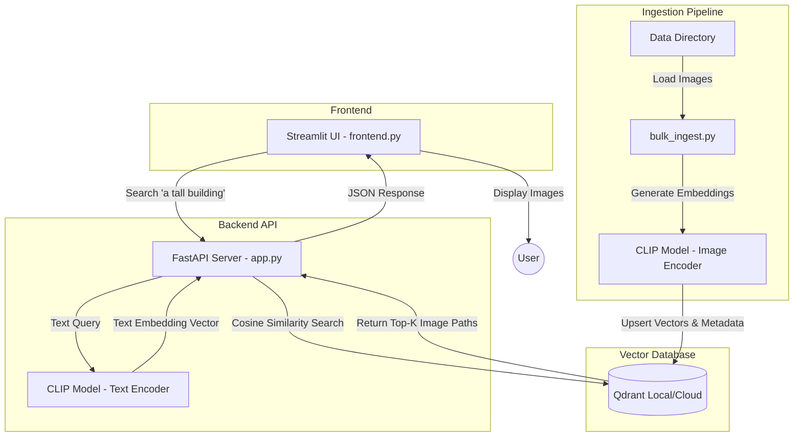
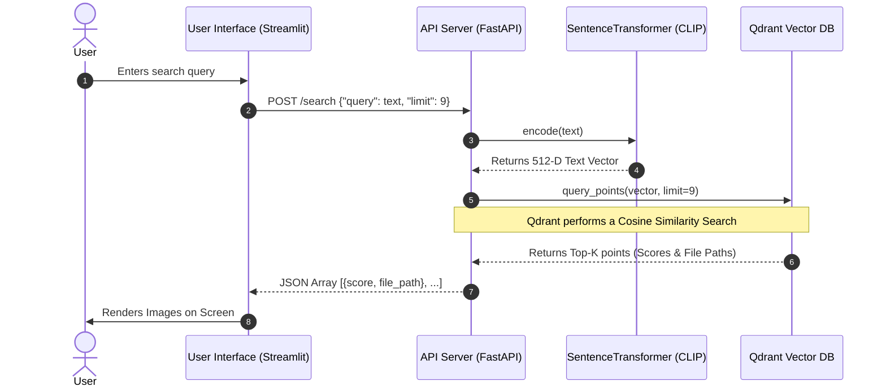

# Lumina: Multimodal Search Engine

## Overview
**Lumina** is a scalable, AI-powered multimodal search engine that allows users to search through a large collection of images using natural language text queries (e.g., *"a tall building at sunset"*). 

Instead of relying on tagged metadata, Lumina "understands" the visual content of the images by leveraging **OpenAI's CLIP model** to map both images and text into a shared mathematical vector space. The high-dimensional vectors are stored and queried efficiently using the **Qdrant Vector Database**.

The system features an interactive **Streamlit frontend** and a high-performance **FastAPI backend**.

---

## System Architecture

The project is structured into three main layers: the Data Ingestion pipeline, the Backend Search API, and the Frontend UI.



### Component Breakdown:
1. **Frontend (`frontend.py`)**: A Streamlit application that accepts user text queries, communicates with the backend API, and displays the image results in a visual grid format.
2. **Backend Engine (`app.py`)**: A FastAPI web server that acts as a bridge. It converts the user's natural language queries into 512-dimensional vector embeddings and communicates with the vector database.
3. **Qdrant Vector Database**: A highly-optimized database (running locally via Docker or in Qdrant Cloud) designed to hold high-dimensional vectors and perform blazing-fast cosine similarity searches.
4. **Data Ingestion scripts (`init_db.py`, `bulk_ingest.py`, `cloud_ingest.py`)**: Scripts that scan a directory of images, feed them through the CLIP vision model to extract embedding vectors, and upload the vectors (along with local paths) into Qdrant.
5. **CLI Search (`search.py`)**: A standalone script that allows you to perform headless queries directly from your terminal.

---

## Multimodal Search Flow

How can you search for images using just text without any tags? 

Lumina uses **CLIP (`clip-ViT-B-32`)**. Multimodal models like CLIP are trained on millions of image-text pairs to embed both text and images into the *exact same vector space*.



### The Magic Context:
Because images of "cats" and the word "cat" map to the same region mathematically in the vector space, a text query vector mapped close to an image vector denotes high semantic similarity. When you query Qdrant using the encoded text vector, it just returns the image vectors that are closest to it using Cosine Distance.

---

## How to Run the Project

### Prerequisites
- Python 3.9+
- Docker (if using local Qdrant)

### 1. Start the Database
Ensure your Qdrant vector database is running. If you are running it locally using Docker, execute:
```bash
docker-compose up -d
```
*(You can verify it's running by navigating to `http://localhost:6333` in your browser).*

### 2. Populate the Database
If you haven't uploaded your images to the vector DB yet, initialize the collection and run the bulk ingest script (ensure your images are in the `data/` folder).
```bash
python init_db.py
python bulk_ingest.py
```

### 3. Start the Application
The project requires the API and the Frontend UI to be run simultaneously in two separate terminals.

**Terminal 1: Start the Backend API**
```bash
# Activate your virtual environment first
source venv/bin/activate
uvicorn app:app --host 0.0.0.0 --port 8000 --reload
```

**Terminal 2: Start the Frontend UI**
```bash
# Activate your virtual environment first
source venv/bin/activate
streamlit run frontend.py
```

Navigate to the `localhost` URL provided by Streamlit (typically `http://localhost:8501`) and start searching!
