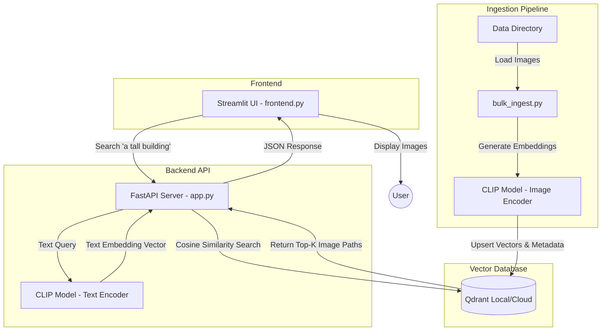

# Lumina: Multimodal Search Engine

**🚀 Live Demo:** [https://lumina-search-engine.streamlit.app](https://lumina-search-engine.streamlit.app)

## Overview
**Lumina** is a scalable, AI-powered multimodal search engine that allows users to search through a large collection of images using natural language text queries (e.g., *"a tall building at sunset"*). 

Instead of relying on tagged metadata, Lumina "understands" the visual content of the images by leveraging **OpenAI's CLIP model** to map both images and text into a shared mathematical vector space. The high-dimensional vectors are stored and queried efficiently using the **Qdrant Vector Database**.

---

## Features
- **Semantic Image Search**: Find images using natural language descriptions without needing any manual tagging.
- **Multimodal Embedding**: Uses `clip-ViT-B-32` from SentenceTransformers to encode both text and images into the same 512-dimensional vector space.
- **Blazing Fast Retrieval**: Powered by Qdrant Vector Database for lightning-fast cosine similarity searches.
- **Interactive UI**: Built with Streamlit for a clean, responsive search experience.
- **Cloud Ready**: Easily deployable on Streamlit Community Cloud with a hosted Qdrant cluster.

---

## System Architecture

The project can be run in two modes:
1. **Cloud Mode (`streamlit_app.py`)**: A unified architecture where Streamlit handles both the UI and the model inference, connecting directly to a remote Qdrant database.
2. **Local Mode**: A decoupled architecture with a FastAPI backend and a Streamlit frontend.

### Decoupled Architecture Flow



### Multimodal Search Flow
How can you search for images using just text without any tags? 
Lumina uses **CLIP**. Multimodal models like CLIP are trained on millions of image-text pairs to embed both text and images into the *exact same vector space*. Because images of "cats" and the word "cat" map to the same region mathematically, a text query vector mapped close to an image vector denotes high semantic similarity. When you query Qdrant using the encoded text vector, it just returns the image vectors that are closest to it using Cosine Distance.

---

## Getting Started

### Prerequisites
- Python 3.9+
- Docker (optional, if running Qdrant locally)

### 1. Installation

Clone the repository and install the dependencies:
```bash
python3 -m venv venv
source venv/bin/activate
pip install -r requirements.txt
```

### 2. Start the Database
If you are running Qdrant locally using Docker, execute:
```bash
docker-compose up -d
```
*(You can verify it's running by navigating to `http://localhost:6333` in your browser).*

### 3. Populate the Database
To ingest your own images into the vector database, place them in the `data/` folder and run the ingestion scripts:
```bash
python init_db.py
python bulk_ingest.py
```

### 4. Run the Application

#### Option A: Standalone Cloud Version (Recommended)
This runs the unified Streamlit app that is optimized for cloud deployment.
```bash
streamlit run streamlit_app.py
```

#### Option B: Decoupled Local Version
This requires the API and the Frontend UI to be run simultaneously in two separate terminals.

**Terminal 1: Start the Backend API**
```bash
source venv/bin/activate
uvicorn app:app --host 0.0.0.0 --port 8000 --reload
```

**Terminal 2: Start the Frontend UI**
```bash
source venv/bin/activate
streamlit run frontend.py
```

Navigate to `http://localhost:8501` to start searching!

---

## Secrets Management
If you are connecting to a remote Qdrant Cloud cluster, ensure you set your environment variables or Streamlit secrets:
- `QDRANT_URL`: The URL of your Qdrant cluster.
- `QDRANT_API_KEY`: Your Qdrant API key.

If deploying on Streamlit Community Cloud, add these to your app's **Secrets** settings.
