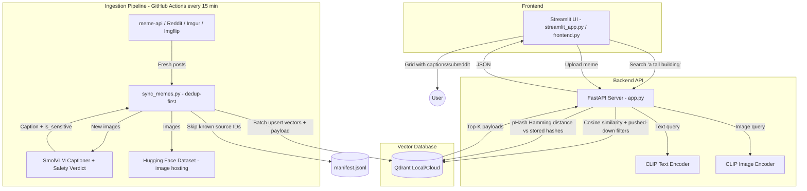

# Lumina: Multimodal Meme Search Engine

**🚀 Live Demo:** [https://lumina-search-engine.streamlit.app](https://lumina-search-engine.streamlit.app)

[](https://lumina-search-engine.streamlit.app)
[](.github/workflows/meme-sync.yml)
[](requirements.txt)
[](https://streamlit.io/)
[](https://qdrant.tech/)

## Overview

**Lumina** is a meme search engine that finds images by caption, meaning,
reaction, template — **or by uploading another image of the meme**. It maps
images and text into a shared vector space with OpenAI's **CLIP**, enriches
every indexed meme with **SmolVLM-generated captions and safety verdicts** at
ingestion time, detects reposts with **perceptual hashing**, and queries
everything through the **Qdrant** vector database.

### What's new in v3

- **Reverse meme search** — upload or snap a meme; exact reposts and
  near-duplicates (pHash distance ≤ 8) are flagged and ranked first.
- **VLM captions** — SmolVLM describes each meme during ingestion, so search
  matches on *meaning* ("Drake rejecting writing tests"), not just OCR'd words.
  The VLM never runs at query time, keeping the hosted app's memory flat.
- **Real safe-content filtering** — the safety checkbox is now backed by an
  actual `is_sensitive` verdict from the captioner, enforced as a Qdrant filter
  *before* top-K truncation (no more silently missing results).
- **Dedup-first ingestion** — two dedup layers (source IDs + content-hash
  point IDs) mean scheduled syncs skip known memes before downloading or
  embedding anything.
- **Batched everything** — Qdrant upserts and Hugging Face uploads happen in
  batches, not per item.

---

## System Architecture


```mermaid
graph TD
    subgraph Frontend
    UI[Streamlit UI - streamlit_app.py / frontend.py]
    end

    subgraph Backend API
    API[FastAPI Server - app.py]
    CLIP_TXT[CLIP Text Encoder]
    CLIP_IMG[CLIP Image Encoder]
    end

    subgraph Vector Database
    QDRANT[(Qdrant Local/Cloud)]
    end

    subgraph Ingestion Pipeline - GitHub Actions every 15 min
    SOURCES[meme-api / Reddit / Imgur / Imgflip]
    SYNC[sync_memes.py - dedup-first]
    VLM[SmolVLM Captioner + Safety Verdict]
    HF[Hugging Face Dataset - image hosting]
    end

    %% Ingestion flow
    SOURCES -- Fresh posts --> SYNC
    SYNC -- Skip known source IDs --> MANIFEST[(manifest.jsonl)]
    SYNC -- New images --> VLM
    VLM -- Caption + is_sensitive --> SYNC
    SYNC -- Images --> HF
    SYNC -- Batch upsert vectors + payload --> QDRANT

    %% Text search flow
    UI -- "Search 'a tall building'" --> API
    API -- Text query --> CLIP_TXT
    API -- Cosine similarity + pushed-down filters --> QDRANT
    QDRANT -- Top-K payloads --> API
    API -- JSON --> UI
    UI -- Grid with captions/subreddit --> User((User))

    %% Reverse image search flow
    UI -- Upload meme --> API
    API -- Image query --> CLIP_IMG
    API -- pHash Hamming distance vs stored hashes --> QDRANT
```

**Why text can find images:** CLIP is trained on millions of image-text pairs
to embed both into the same space, so "cat" lands near cat pictures. Lumina
queries two named vectors per point (`visual` from CLIP, `semantic_text` from
MiniLM over caption+OCR+title+tags) and fuses them with an exact-term score.

---

## Getting Started

### Prerequisites
- Python 3.11+
- Docker (optional, for local Qdrant)
- Tesseract (`brew install tesseract` / `apt install tesseract-ocr`) — optional;
  without it OCR text is empty but captions still work.

### 1. Install

```bash
python3 -m venv .venv
source .venv/bin/activate
pip install -r requirements.txt
```

### 2. Start Qdrant locally (optional)

```bash
docker-compose up -d   # verify at http://localhost:6333
```

### 3. Populate the database

Migrate an existing legacy index into the captioned collection:

```bash
python3 backfill_v2.py            # resumable; add --limit 3000 for a fast demo
```

…or ingest fresh memes:

```bash
export HF_TOKEN="hf..."
export HF_DATASET_REPO="you/lumina-memes"
python3 sync_memes.py --source meme_api --limit 100
```

To index your own local folder instead: place images in `data/` and run
`python3 ingest_memes.py data`.

### 4. Run

**Screenshot search — local, private mode**

Point Lumina at your own screenshots and search them by meaning. Nothing is
uploaded: images stay on disk, Qdrant runs in local Docker, and CLIP/SmolVLM
run on your machine (Apple Silicon MPS works well).

```bash
docker compose up -d
python3 ingest_screenshots.py --folder ~/Screenshots --limit 100  # try a small batch first
streamlit run screenshot_app.py
```

Search "terminal error about permissions" or "hotel listing with brick wall",
or drop a screenshot into the duplicate finder to check whether it is already
indexed. Ingestion is resumable — rerun it any time; only new files are
processed.

**Option A — standalone cloud meme app (recommended)**

```bash
streamlit run streamlit_app.py
```

**Option B — decoupled local mode**

```bash
uvicorn app:app --host 0.0.0.0 --port 8000   # terminal 1
streamlit run frontend.py                     # terminal 2
```

---

## Configuration

All settings are environment variables (see `config.py`). Key ones:

| Variable | Purpose |
| --- | --- |
| `QDRANT_URL` / `QDRANT_API_KEY` | Qdrant endpoint |
| `MEME_COLLECTION_NAME` | Active collection (default `lumina_memes_v2`; set to `lumina_memes_v1` to roll back) |
| `CAPTION_MODEL_NAME` | Ingestion-time VLM (default `HuggingFaceTB/SmolVLM-500M-Instruct`) |
| `CAPTION_ENABLED` | `0` disables captioning entirely |
| `HF_TOKEN` / `HF_DATASET_REPO` | Public image hosting |
| `MAX_DOWNLOAD_BYTES` | Per-file download cap (default 20 MB) |
| `SCREENSHOT_ROOT` / `SCREENSHOT_COLLECTION_NAME` | Local screenshot mode folder and collection |
Detailed deployment notes live in [`docs/deployment.md`](docs/deployment.md);
ingestion internals in [`docs/ingestion.md`](docs/ingestion.md).

## Current limitations

- **Feed coverage:** the default source samples configured subreddits via
  `meme-api.com`; it does not search all of Reddit, and unindexed topics have
  nothing to return.
- **Search freshness:** new memes become searchable after the next successful
  workflow run; GitHub Actions schedules can be delayed.
- **Source availability:** unofficial feeds may rate-limit or disappear;
  official Reddit API access remains preferable for production.
- **Licensing/moderation:** memes stay hosted by their sources/HF dataset;
  verify terms and respect takedowns. The safe filter is a model heuristic,
  not a guarantee.
- **Free-tier limits:** Qdrant Cloud, Hugging Face, Streamlit Community Cloud,
  and GitHub Actions all carry quotas.
