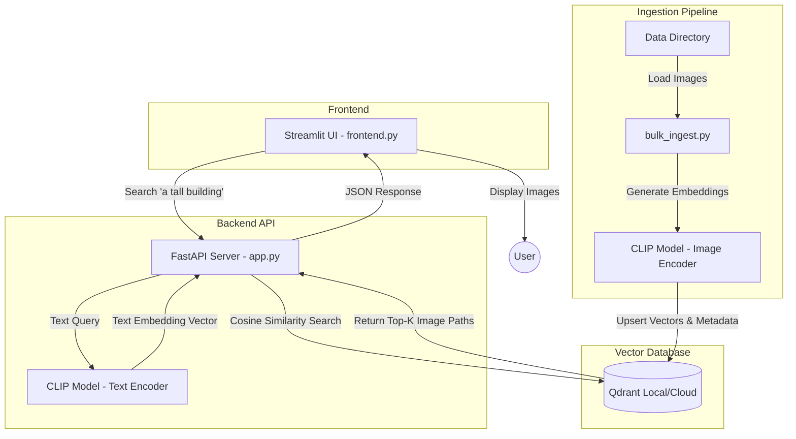

# Lumina: Multimodal Search Engine

**🚀 Live Demo:** [https://lumina-search-engine.streamlit.app](https://lumina-search-engine.streamlit.app)

[](https://lumina-search-engine.streamlit.app)
[](.github/workflows/meme-sync.yml)
[](requirements.txt)
[](https://streamlit.io/)
[](https://qdrant.tech/)

## Overview
**Lumina** is now a meme-focused search engine that finds images by caption text, meaning, reaction, and template. The original image collection remains available in `lumina_multimodal`; meme indexing uses the versioned `lumina_memes_v1` collection.

Instead of relying on tagged metadata, Lumina "understands" the visual content of the images by leveraging **OpenAI's CLIP model** to map both images and text into a shared mathematical vector space. The high-dimensional vectors are stored and queried efficiently using the **Qdrant Vector Database**.

---

## Features
- **Meme Search**: Search by exact caption, paraphrased meaning, reaction, character, or template.
- **OCR Indexing**: Extracts text printed in memes and keeps a normalized copy for matching.
- **Hybrid Retrieval**: Combines CLIP visual similarity, semantic text similarity, and exact term overlap.
- **Idempotent Ingestion**: Content-based IDs avoid duplicate points when ingestion is rerun.
- **Blazing Fast Retrieval**: Powered by Qdrant Vector Database for lightning-fast cosine similarity searches.
- **Interactive UI**: Built with Streamlit for a clean, responsive search experience.
- **Cloud Ready**: Easily deployable on Streamlit Community Cloud with a hosted Qdrant cluster.
- **Automatic Fresh-Meme Sync**: GitHub Actions fetches new memes every 15 minutes, uploads images to Hugging Face, and indexes them in Qdrant—even when your computer is offline.

---

## System Architecture

The project can be run in two modes:
1. **Cloud Mode (`streamlit_app.py`)**: A unified architecture where Streamlit handles both the UI and the model inference, connecting directly to a remote Qdrant database.
2. **Local Mode**: A decoupled architecture with a FastAPI backend and a Streamlit frontend.

### Decoupled Architecture Flow


```mermaid
graph TD
    subgraph Frontend
    UI[Streamlit UI - frontend.py]
    end

    subgraph Backend API
    API[FastAPI Server - app.py]
    CLIP_TXT[CLIP Model - Text Encoder]
    end

    subgraph Vector Database
    QDRANT[(Qdrant Local/Cloud)]
    end

    subgraph Ingestion Pipeline
    IMG_DIR[Data Directory]
    BULK_ING[bulk_ingest.py]
    CLIP_IMG[CLIP Model - Image Encoder]
    end

    %% Data Flow
    IMG_DIR -- Load Images --> BULK_ING
    BULK_ING -- Generate Embeddings --> CLIP_IMG
    CLIP_IMG -- Upsert Vectors & Metadata --> QDRANT

    %% Search Flow
    UI -- "Search 'a tall building'" --> API
    API -- Text Query --> CLIP_TXT
    CLIP_TXT -- Text Embedding Vector --> API
    API -- Cosine Similarity Search --> QDRANT
    QDRANT -- Return Top-K Image Paths --> API
    API -- JSON Response --> UI
    UI -- Display Images --> User((User))
```

### Multimodal Search Flow
How can you search for images using just text without any tags? 
Lumina uses **CLIP**. Multimodal models like CLIP are trained on millions of image-text pairs to embed both text and images into the *exact same vector space*. Because images of "cats" and the word "cat" map to the same region mathematically, a text query vector mapped close to an image vector denotes high semantic similarity. When you query Qdrant using the encoded text vector, it just returns the image vectors that are closest to it using Cosine Distance.

---

## Getting Started

### Cloud deployment and automatic updates

The production setup uses three free-tier services:

1. **Streamlit Community Cloud** runs `streamlit_app.py` and connects users to Qdrant.
2. **Qdrant Cloud** stores the named visual and semantic meme vectors.
3. **Hugging Face Datasets** stores publicly accessible image files.

The workflow in `.github/workflows/meme-sync.yml` runs every 15 minutes (and can also be started manually). Add these repository secrets in **GitHub → Settings → Secrets and variables → Actions**:

```text
QDRANT_URL
QDRANT_API_KEY
HF_TOKEN
HF_DATASET_REPO=Shshank/lumina-memes
```

The sync currently uses the Reddit-backed `meme-api.com` fallback and pulls general, programming, and car-meme feeds. It is a feed, not a keyword-search API: a query can only match memes that have already been ingested. Complete arbitrary-topic coverage requires a searchable provider (for example, approved Reddit API access) or a larger continuously ingested corpus.

For a manual run, open **Actions → Sync fresh memes → Run workflow**.

### Current limitations

- **Feed coverage:** The default source is the Reddit-backed `meme-api.com` feed. It samples configured subreddits; it does not search all of Reddit or guarantee a result for every keyword.
- **Search freshness:** New memes become searchable after the next successful scheduled workflow run. GitHub Actions schedules can be delayed occasionally.
- **Source availability:** `meme-api.com` is an unofficial fallback. It may rate-limit, return duplicates, remove posts, or become temporarily unavailable. Official Reddit API access is still preferable for a production integration.
- **Content licensing and moderation:** Meme images remain hosted by their source/Hugging Face dataset. Verify each source's terms, respect takedown requests, and do not assume commercial redistribution rights. The safe-content checkbox is a heuristic, not a guarantee.
- **Image availability:** Deleted, private, hotlinked, or expired source images may show no image even when their vector remains indexed until cleanup.
- **Free-tier limits:** Qdrant Cloud, Hugging Face, Streamlit Community Cloud, and GitHub Actions have quotas, sleeping/hibernation behavior, and rate limits. Large collections or high traffic may require paid resources.
- **Model/runtime cost:** The first Streamlit startup downloads embedding models and can be slow; memory and CPU are limited on free hosting.
- **Arbitrary-topic guarantee:** Semantic search ranks the indexed corpus; it cannot generate or fetch a matching meme for a topic that has not been ingested.

### Prerequisites
- Python 3.9+
- Docker (optional, if running Qdrant locally)

### 1. Installation

Clone the repository and install the dependencies:
```bash
python3 -m venv venv
source venv/bin/activate
pip install -r requirements.txt
```

### 2. Start the Database
If you are running Qdrant locally using Docker, execute:
```bash
docker-compose up -d
```
*(You can verify it's running by navigating to `http://localhost:6333` in your browser).*

### 3. Populate the Database
To ingest your own images into the vector database, place them in the `data/` folder and run the ingestion scripts:
```bash
python3 init_meme_db.py
python3 ingest_memes.py data
```

### 4. Run the Application

#### Option A: Standalone Cloud Version (Recommended)
This runs the unified Streamlit app that is optimized for cloud deployment.
```bash
streamlit run streamlit_app.py
```

#### Option B: Decoupled Local Version
This requires the API and the Frontend UI to be run simultaneously in two separate terminals.

**Terminal 1: Start the Backend API**
```bash
source venv/bin/activate
uvicorn app:app --host 0.0.0.0 --port 8000 --reload
```

**Terminal 2: Start the Frontend UI**
```bash
source venv/bin/activate
streamlit run frontend.py
```

Navigate to `http://localhost:8501` to start searching!

---

## Secrets Management
If you are connecting to a remote Qdrant Cloud cluster, ensure you set your environment variables or Streamlit secrets:
- `QDRANT_URL`: The URL of your Qdrant cluster.
- `QDRANT_API_KEY`: Your Qdrant API key.

If deploying on Streamlit Community Cloud, add these to your app's **Secrets** settings.
