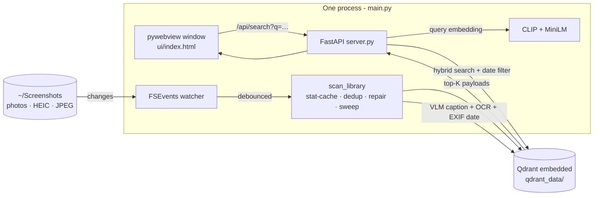

# Lumina — Private Memory Search for macOS

**Find any screenshot or photo by describing it.** "The terminal error about
permissions last week", "hotel listing with a brick wall", "that whiteboard
from March" — Lumina indexes your screenshots and photos, captions them with a
local vision model, and makes everything searchable by *meaning*, *on-screen
text*, and *time*. Nothing ever leaves your machine.

[](requirements.txt)
[](.github/workflows/ci.yml)
[](#privacy-model)

## What you get

- **Meaning search** — CLIP visual vectors + MiniLM text vectors over VLM
  captions and OCR text, fused and reranked in one query.
- **Time-aware queries** — type *"invoices since June"* or *"that bug
  yesterday"*; the date range is parsed out of your sentence and pushed into
  the database as a real filter.
- **Reverse image / duplicate finder** — drop any image; exact reposts and
  near-duplicates are flagged via perceptual hashing.
- **Find similar** — every result is one click away from its visual neighbors.
- **Live index** — an FSEvents watcher picks up new screenshots ~10 s after
  you take them.
- **Native-feeling app** — pywebview window over a local FastAPI server; no
  browser tabs, no cloud, no accounts.

## Quick start

```bash
python3 -m venv .venv
source .venv/bin/activate
pip install -r requirements.txt

python main.py          # opens the Lumina window, indexes ~/Screenshots
```

First start loads CLIP + MiniLM (and optionally SmolVLM for captioning) and
runs the initial scan — grab a coffee on big libraries. After that, indexing
is incremental and cheap.

Useful variants:

```bash
python main.py --folder ~/Pictures --watch      # different library root
python main.py --no-watch                       # manual reindex only
python main.py --web                            # headless; open http://127.0.0.1:8337
```

Double-click alternative: `Lumina.command` (Finder → double-click).

## How it works


```mermaid
graph LR
    subgraph One process - main.py
        UI[pywebview window<br/>ui/index.html]
        API[FastAPI server.py]
        MODELS[CLIP + MiniLM]
        WATCHER[FSEvents watcher]
        INGEST[scan_library<br/>stat-cache · dedup · repair · sweep]
    end

    LIB[(~/Screenshots<br/>photos · HEIC · JPEG)]
    DB[(Qdrant embedded<br/>qdrant_data/)]

    LIB -- changes --> WATCHER -- debounced --> INGEST --> DB
    INGEST -- "VLM caption + OCR + EXIF date" --> DB
    UI -- "/api/search?q=…" --> API
    API -- query embedding --> MODELS
    API -- "hybrid search + date filter" --> DB
    DB -- top-K payloads --> API --> UI
```

**Why text finds images:** every indexed file gets two vectors — a CLIP
*visual* embedding and a MiniLM *semantic_text* embedding of
`caption + OCR + tags` — plus exact-term scoring, fused with per-profile
weights (`memory`: 10% visual / 50% semantic / 40% exact). Date phrases like
*"last week"* become `DatetimeRange` filters evaluated inside Qdrant before
top-K truncation.

**Why rescans are cheap:** a stat-signature cache (size + mtime) skips
unchanged files without re-hashing; content hashes make point IDs stable, so
moved files are repaired in place instead of re-captioned.

## The API

The UI talks to these; curl them too at `http://127.0.0.1:8337`:

| Endpoint | Purpose |
| --- | --- |
| `GET /api/search?q=…&limit=&safe=` | hybrid meaning search with NL date parsing |
| `GET /api/similar/{point_id}` | visual neighbors of an indexed item |
| `POST /api/duplicate` | multipart image upload → repost verdict |
| `GET /api/image?path=` | serve an **indexed** file only |
| `POST /api/open` | reveal an **indexed** file in Finder |
| `GET /api/status` | counts, watcher state, last scan, failures |
| `POST /api/reindex` | run an incremental scan now |

Image/open endpoints verify the path exists in the index before touching the
filesystem — nothing outside your library is reachable.

## Configuration

Environment variables (see `config.py`):

| Variable | Default | Purpose |
| --- | --- | --- |
| `SCREENSHOT_ROOT` | `~/Screenshots` | library folder to index/watch |
| `MEMORY_COLLECTION_NAME` | `lumina_memory_v1` | active Qdrant collection |
| `MEMORY_STORAGE_PATH` | `./qdrant_data` | embedded Qdrant data directory |
| `SERVER_HOST` / `SERVER_PORT` | `127.0.0.1:8337` | local API/UI bind address |
| `CAPTION_ENABLED` | `1` | SmolVLM captioning during ingestion |
| `CAPTION_MODEL_NAME` | `SmolVLM-500M-Instruct` | ingestion-time VLM |
| `RETRIEVAL_PROFILE` | `memory` | score-fusion weights (`memory` / `meme`) |
| `QDRANT_URL` *(optional)* | unset → embedded | set to use a Qdrant server/Docker instead |

## CLI tools

| Command | Purpose |
| --- | --- |
| `python main.py` | the app (server + window + watcher) |
| `python ingest_screenshots.py` | one-shot incremental scan, then exit |
| `python ingest_screenshots.py --watch` | standalone watcher (no UI/server) |
| `python server.py --web` | API only |

See [`docs/watch-mode.md`](docs/watch-mode.md) for debounce tuning, the stat
cache, and keeping the index fresh across reboots via launchd
([`launchd/com.lumina.watch.plist`](launchd/com.lumina.watch.plist)).

## Privacy model

- Images never leave the machine. Embeddings, captions, and OCR all run
  locally; the server binds to `127.0.0.1` only.
- Data lives in two places: `qdrant_data/` (vectors + metadata) and
  `.lumina_state.json` (scan cache). Delete both to forget everything;
  uninstalling is just deleting the project folder.
- The safe-content filter is a SmolVLM heuristic enforced as a database
  filter — helpful, not a guarantee.

## Limitations

- macOS-first: Finder reveal (`open -R`) and launchd integration assume macOS;
  the engine itself is portable Python.
- First full-library index is slow while SmolVLM captions each new file
  (set `CAPTION_ENABLED=0` for a fast OCR+visual-only pass).
- Tesseract (`brew install tesseract`) is optional but recommended — OCR
  materially improves recall on text-heavy screenshots.
- Embedded Qdrant allows exactly one process per data directory; that's why
  `main.py` hosts everything in a single process.
